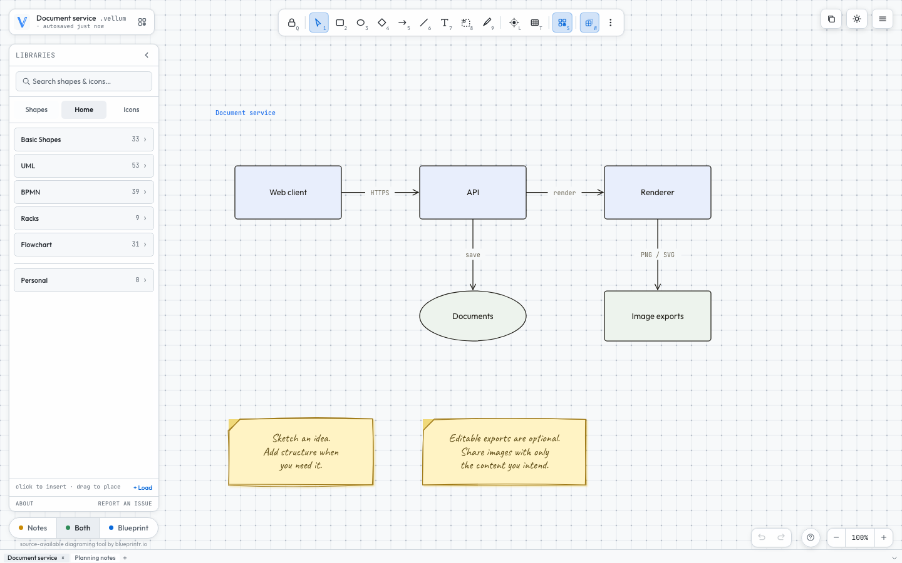
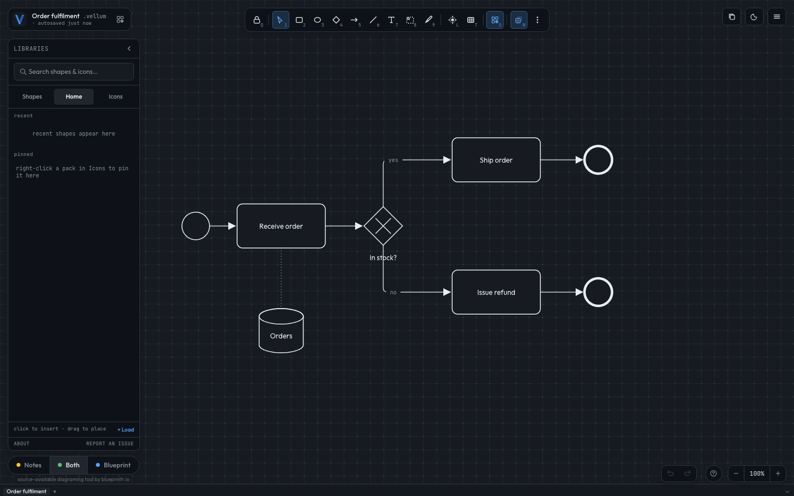
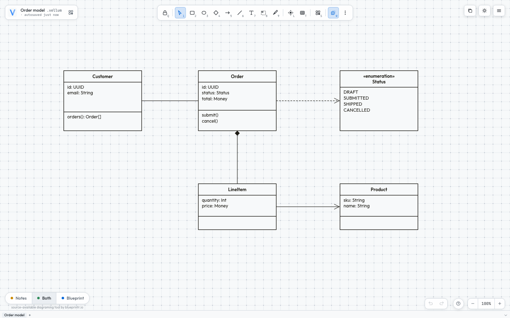

# Vellum

Vellum is a diagram editor for architecture, process and software design
diagrams. It runs in the browser or as a desktop app and saves each diagram as
a readable YAML file that you can diff, review and edit by hand.

**[Try it in your browser at vellum.blueprintr.io](https://vellum.blueprintr.io)**



## Features

- A keyboard-driven canvas. Number keys pick tools, `S` opens the shape
  library, and every change can be undone.
- Two layers on one canvas: hand-drawn notes for rough thinking and a blueprint
  layer for the finished diagram. Show either layer or both.
- Native UML, BPMN and flowchart shapes (41 UML, 32 BPMN and 31 flowchart),
  33 basic shapes, freeform outlines and rack diagrams from 1U to 100U.
- Connectors with orthogonal, curved or straight routing, draggable waypoints,
  hops where lines cross and presets for UML and BPMN relationships.
- SVG icon libraries. You can import your own icons from an SVG folder, a ZIP
  file or a `.vssx` stencil, then recolour them.
- Several diagrams per file, one per tab. In browsers with the File System
  Access API, Vellum autosaves to the file you opened. Browser recovery keeps
  every open tab if the page closes unexpectedly.
- Imports `.drawio`, `.excalidraw` and Mermaid files.
- Exports PNG, JPG, WebP, SVG, PDF and animated GIF. PNG and SVG exports can
  optionally include the diagram source, so the image reopens as an editable
  diagram.
- Embeds in other React applications as a component.





## Run it locally

You need Node.js 20 or later.

```sh
npm ci
npm run dev:web
```

Then open http://localhost:5173. Files save through the File System Access API
where the browser supports it and fall back to a download elsewhere.

To build a production bundle into `dist/`:

```sh
npm run build
```

The desktop app uses [Tauri](https://tauri.app). With a Rust toolchain
installed, `npm run tauri:dev` runs it locally.

## Diagrams as YAML

A `.vellum` file is YAML. Each file holds an ordered list of tabs, and each tab
holds one diagram with its shapes, connectors, annotations and optional image
assets. Older single-diagram files still open as one tab.

Each diagram also has a `graph` section with one line per connection, so the
structure reads without the layout detail:

```yaml
version: "1.0"
graph:
  - CloudFront -> API Gateway: HTTPS
  - API Gateway -> render-worker: invoke
  - render-worker -- Redis cache?
meta:
  title: checkout-flow
shapes:
  # position, size and styling for each shape
connectors:
  # anchors, routing, waypoints and markers for each connector
```

Edges are `->` (arrow), `--` (plain line) or `<->` (double-headed). The section
is editable. Deleting a line deletes that connector, adding a line creates one,
and naming a node that does not exist creates it, so you can type a diagram as
a `graph` section alone. The section is regenerated from `connectors` on every
save. If another tool edits `connectors` without updating it, the connector
details take precedence.

[`src/store/types.ts`](./src/store/types.ts) defines the format,
[`src/store/graph.ts`](./src/store/graph.ts) documents the graph grammar and
[`src/store/schema.ts`](./src/store/schema.ts) validates every file, paste and
library drop before it reaches the editor.

## Exports and privacy

`⌘S` opens the export dialog, and `⇧⌘C` copies the selection as a PNG. Every
export path uses the same pipeline, so the dialog preview matches the saved
file.

Editable source is off by default and resets each time the dialog opens. When
you turn it on, the image contains the full diagram, including hidden layers,
notes and content outside the exported area. Clipboard copies never include
it. SVG viewport crops keep vector objects outside the visible area, so use
PNG for a flattened crop.

The [guide](./GUIDE.md) covers export options, saving and recovery, and the
UML, BPMN, rack and freeform tools in detail.

## Use it as a React component

```tsx
import { VellumEditor } from 'vellum-editor';
import 'vellum-editor/styles.css';

export default function App() {
  return <VellumEditor />;
}
```

The package exports the editor, its Zustand store hook (`useEditor`), YAML
serialization (`diagramToYaml`, `yamlToDiagram`), validation (`parseDiagram`)
and the SVG sanitizer. See [`src/index.ts`](./src/index.ts) for the full list.
The package currently ships TypeScript source, so your project needs a
TypeScript toolchain.

## Security

Every SVG and diagram that Vellum loads passes through DOMPurify and a Zod
schema, and [`index.html`](./index.html) sets a strict Content Security
Policy. Please report vulnerabilities privately as described in
[SECURITY.md](./SECURITY.md) rather than in a public issue.

## Contributing

See [CONTRIBUTING.md](./CONTRIBUTING.md). Small, focused pull requests are
easiest to review. Contributions are accepted under the contributor terms in
that file.

## License

Vellum is source-available under the
[PolyForm Noncommercial License 1.0.0](./LICENSE). Use, modification and
redistribution are subject to that license, including its permitted-purpose
and notice requirements. This README grants no additional permissions.
For use outside those terms, contact [Josh Morris](mailto:josh@blueprintr.io)
about a separate license. Imported artwork and dependencies keep their own
licenses; see [credits](./legal/credits.md).
